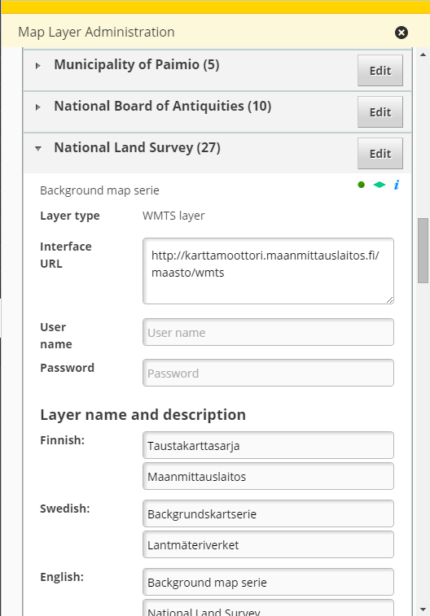

# admin-layerselector

Admin tools for managing maplayer configurations

## Description

The bundle offers admin a listing for all the maplayers available in Oskari. The maplayers are grouped by topic or organization by selecting a tab in the upper part of the flyout. For each maplayer there is an icon presenting layer type (wms/wfs/base/wmts/vector)and an i-icon if the layer has a "dataurl" property. The admin can add new organizations and remove them. It is also possible to add new maplayers and remove old ones. Support for adding group and base layers and sublayers to them was added in Oskari version 1.13.

## TODO

* Add Inspire Themes (needs backend work)
* Modal dialog when user is removing organization or layer
* Backend should return json if user is removing organization
* Backend should return error if user is removing organization which contains layer
* Map layer service should do something when layer is updated
* Backend should be configured to handle admin bundles based on user role
* Filter mechanism is not ready yet
* Add Organization & add Inspire theme needs some further work on layerSelector2 bundle

## Screenshot

## Bundle configuration

Frontend has no configuration, but the bundle is usually configured to be shown only to admin users. Configuration is done in oskari-server using oskari-ext.properties.

## Events the bundle listens to

<table class="table">
  <tr>
    <th> Event </th><th> How does the bundle react</th>
  </tr>
  <tr>
    <td> MapLayerEvent </td><td> Updates the UI with data from MapLayerService - if operation is 'add' (adds the maplayer), 'remove' (removes the maplayer) or 'update' (updates layers name)</td>
  </tr>
</table>

## Dependencies

<table class="table">
  <tr>
    <th> Dependency </th><th> Linked from </th><th> Purpose </th>
  </tr>
  <tr>
    <td> [jQuery](http://api.jquery.com/) </td>
    <td> Linked in portal theme </td>
    <td> Used to create the component UI from begin to end</td>
  </tr>
  <tr>
    <td> [Oskari divmanazer](/documentation/bundles/framework/divmanazer) </td>
    <td> Expects to be present in application setup </td>
    <td> Oskari's Div handler bundle</td>
  </tr>
  <tr>
    <td> [Backend API](/documentation/backend/layerselector) </td>
    <td> N/A </td>
    <td> Get all Maplayers from backend</td>
  </tr>
  <tr>
    <td> [Oskari layerselector2](/documentation/bundles/framework/layerselector) </td>
    <td> N/A </td>
    <td> User can select maplayers when needed</td>
  </tr>
</table>
