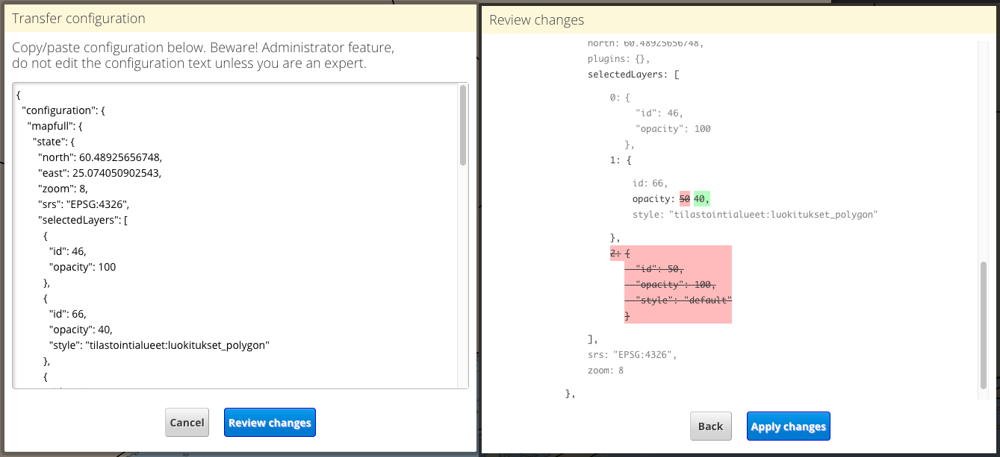

# admin-publish-transfer

Admin tool for transferring published map configurations from one user to another. Can also be used to edit published map configuration JSON manually. Can only be used for tranfers within one Oskari instance (one server).

## Description

When the bundle is loaded it will create a new tool into the map publisher under "Transfer configuration". By clicking "Open editor" the user sees the current map publisher state as JSON and can copy/paste or even edit it manually. After clicking on "Review changes" the user sees another dialog with a visual JSON diff. The by clicking "Apply changes", the JSON is used to set the current map publisher state. The user can then continue editing via the normal publisher UI and save the published map.

**WARNING** This is a very advanced functionality, and it is expected that the user knows how to edit the published map JSON configuration. Not for end-users.

## Screenshot

