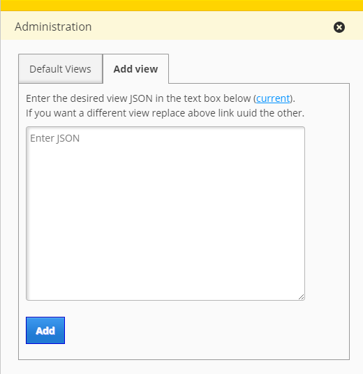

# appsetup

Importing and exporting AppSetups using JSON definition.

## Description

This bundle adds a new tab to generic admin ui. Admin users can import AppSetups (views) from JSON definitions to the system. Also provides a link for exporting AppSetups. The UI provides details (uuid, id and url) of the added view after successful import.

## Screenshot

## Bundle configuration

No configuration is required.

## Bundle state

No state is required.

## Dependencies

<table class="table">
  <tr>
    <th>Dependency</th><th>Linked from</th><th>Purpose</th>
  </tr>
  <tr>
    <td> [jQuery](http://api.jquery.com/) </td>
    <td> Version 1.7.1 assumed to be linked on the page</td>
    <td> Used to create the UI</td>
  </tr>
</table>
