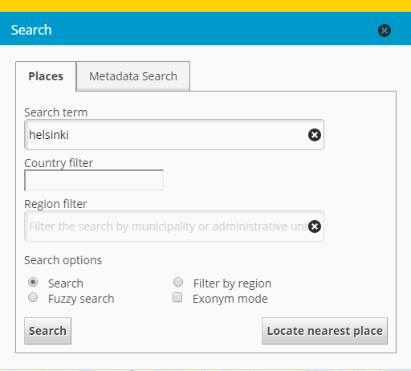

# ELF Geolocator

<table class="table">
  <tr>
    <td>ID</td><td>`elf-geolocator`</td>
  </tr>
</table>

## Description

Creates a service and a user interface for ELF Geolocator search API. Creates an UI for search bundle to perform text searches and adds a button to the toolbar for reverse geocode search.

## Screenshot

## Bundle configuration

No configuration is required.

## Bundle state

No state handling has been implemented.

## Requests the bundle handles

This bundle doesn't handle any requests.

## Requests the bundle sends out

<table class="table">
  <tr>
    <th> Request </th><th> Where/why it's used</th>
  </tr>
  <tr>
    <td> `MapMoveRequest` </td>
    <td> Moves the map to the search results when clicked in the grid or from the reverse geocode search tool </td>
  </tr>
  <tr>
    <td> `InfoBox.ShowInfoBoxRequest` </td>
    <td> Shows the info of the result </td>
  </tr>
  <tr>
    <td> `Toolbar.SelectToolButtonRequest` </td>
    <td> Selects the default tool after the map has been clicked with the reverse geocode search tool selected </td>
  </tr>
  <tr>
    <td> `Toolbar.AddToolButtonRequest` </td>
    <td> Requests the reverse geocode search tool to be added to the toolbar </td>
  </tr>
  <tr>
    <td> `userinterface.AddExtensionRequest` </td>
    <td> Adds the Flyout for the bundle </td>
  </tr>
  <tr>
    <td> `Search.AddTabRequest` </td>
    <td> Adds the search ui tab to the search bundle </td>
  </tr>
</table>

## Events the bundle listens to

<table class="table">
  <tr>
    <th> Event </th><th> How does the bundle react</th>
  </tr>
  <tr>
    <td> `MapClickedEvent` </td>
    <td> Sends a reverse geocode search request with the clicked coordinates </td>
  </tr>
  <tr>
    <td> `Toolbar.ToolSelectedEvent` </td>
    <td> If not the tool we're looking for, stops our tool </td>
  </tr>
</table>

## Events the bundle sends out

This bundle doesn't send any events.

## Dependencies

<table class="table">
  <tr>
    <th>Dependency</th><th>Linked from</th><th>Purpose</th>
  </tr>
  <tr>
    <td>`jQuery`</td>
    <td>Assumes to be linked from the page</td>
    <td>UI building</td>
  </tr>
  <tr>
    <td>`lodash`</td>
    <td>Assumes to be linked</td>
    <td>Utility library</td>
  </tr>
  <tr>
    <td>`divmanazer`</td>
    <td>Assumes to be present in the application setup</td>
    <td>Extensions and ui components</td>
  </tr>
  <tr>
    <td>`toolbar`</td>
    <td>Assumes to be present in the application setup</td>
    <td>Adds the reverse geocode search tool (not required if the aforementioned tool is not needed)</td>
  </tr>
  <tr>
    <td>`search`</td>
    <td>Assumes to be present in the application setup</td>
    <td>Adds the search tab (not required if the text search functionality is not needed)</td>
  </tr>
</table>
