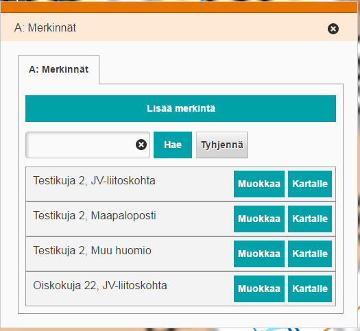

# Water pipe tool

<table class="table">
  <tr>
    <td>ID</td><td>waterPipeTool.Bundle</td>
  </tr>
</table>

## Description

This bundle provides a new admin tool to define waterpipe markings. Admin user can edit, delete or create waterpipe markings.

## Screenshot

## Bundle configuration

No configuration is required.

## Bundle state

No statehandling has been implemented.

## Requests the bundle handles

This bundle doesn't handle any requests.

## Requests the bundle sends out

<table class="table">
  <tr>
    <th> Request </th><th> Where/why it's used</th>
  </tr>
  <tr>
    <td>`userinterface.AddExtensionRequest`</td><td> Register as part of the UI in start()-method.</td>
  </tr>
  <tr>
    <td>`userinterface.RemoveExtensionRequest`</td><td> Unregister from the UI in stop()-method.</td>
  </tr>
  <tr>
    <td>`MapModulePlugin.AddFeaturesToMapRequest`</td><td> For feature drawing.</td>
  </tr>
  <tr>
    <td>`MapModulePlugin.RemoveFeaturesFromMapRequest`</td><td> Remove features from map.</td>
  </tr>
  <tr>
    <td>`AddMapLayerRequest`</td><td> Puts certain layers on.</td>
  </tr>
  <tr>
    <td>`AddMapLayerRequest`</td><td> Puts certain layers on.</td>
  </tr>
  <tr>
    <td>`MapModulePlugin.GetFeatureInfoActivationRequest`</td><td> Activate normal GFI event.</td>
  </tr>
  <tr>
    <td>`WfsLayerPlugin.ActivateHighlightRequest`</td><td> Activate normal WFS event.</td>
  </tr>
</table>

## Events the bundle listens to

<table class="table">
  <tr>
    <th>Event</th><th>How does the bundle react</th>
  </tr>
  <tr>
    <td>`userinterface.ExtensionUpdatedEvent`</td>
    <td>Listens to `search-from-channels` Flyout opens/closes</td>
  </tr>
  <tr>
    <td>`MapClickedEvent`</td>
    <td>Listens to map clicked event. Bundle collects needed data from WMS interfaces</td>
  </tr>
</table>

## Events the bundle sends out

<table class="table">
  <tr>
    <th>Event</th><th>How does the bundle react</th>
  </tr>
  <tr>
    <td>`Printout.PrintableContentEvent`</td>
    <td>Sends geojson for print event</td>
  </tr>
</table>

## Dependencies

<table class="table">
  <tr>
    <th>Dependency</th><th>Linked from</th><th>Purpose</th>
  </tr>
  <tr>
    <td>[jQuery](http://api.jquery.com/)</td>
    <td>Assumes to be linked in the page</td>
    <td>Used to create the component UI from begin to end</td>
  </tr>
</table>
