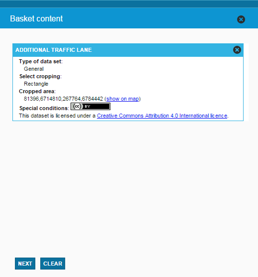
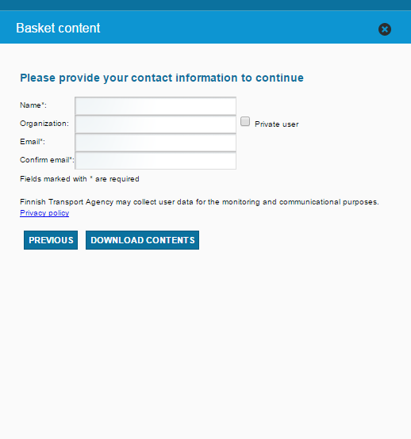

# LaKaPa Basket

<table class="table">
  <tr>
    <td>ID</td><td>LakapaBasketBundle</td>
  </tr>
</table>

## Description

This bundle provides a basket tool. Users can add or remove downloadable packets to basket and then downloads them.

## Screenshot





## Bundle configuration

No configuration is required, but it can be used to set urls and published digiroad month/year.

```javascript
"specialConditions": {
  "railway": {
    "fi": {},
    "sv": {},
    "en": {}
  },
  "sea": {
    "fi": {},
    "sv": {},
    "en": {}
  },
  "road": {
    "fi": {},
    "sv": {},
    "en": {}
  },
  "beta": {
    "fi": {},
    "sv": {},
    "en": {}
  }
},
"normalConditions": "",
"loadPrefixUrl": "",
"digiroadPublished": "",
"userdataSaveInfoUrl": ""
```

## Bundle state

No statehandling has been implemented.

## Requests the bundle handles

<table class="table">
  <tr>
    <th>Request</th><th>Where/why it's used</th>
  </tr>
  <tr>
    <td>`AddToBasketRequest`</td><td>Add item to basket</td>
  </tr>
  <tr>
    <td>`ClearBasketRequest`</td><td>Clears basket</td>
  </tr>
  <tr>
    <td>`RefreshBasketRequest`</td><td>Refresh basket</td>
  </tr>
</table>

## Requests the bundle sends out


<table class="table">
  <tr>
    <th>Request</th><th>Where/why it's used</th>
  </tr>
  <tr>
    <td>`ShowMessageRequest`</td><td>Show message</td>
  </tr>
  <tr>
    <td>`userinterface.AddExtensionRequest`</td><td>Register as part of the UI in start()-method.</td>
  </tr>
  <tr>
    <td>`userinterface.RemoveExtensionRequest`</td><td>Unregister from the UI in stop()-method.</td>
  </tr>
</table>


## Events the bundle listens to

<table class="table">
  <tr>
    <th>Event</th><th>How does the bundle react</th>
  </tr>
  <tr>
    <td>`userinterface.ExtensionUpdatedEvent`</td>
    <td>Listens to `lakapa-basket` Flyout opens/closes</td>
  </tr>
</table>

## Events the bundle sends out

This bundle doesn't send any events.

## Dependencies

<table class="table">
  <tr>
    <th>Dependency</th><th>Linked from</th><th>Purpose</th>
  </tr>
  <tr>
    <td>[jQuery](http://api.jquery.com/)</td>
    <td>Assumes to be linked in the page</td>
    <td>Used to create the component UI from begin to end</td>
  </tr>
</table>
