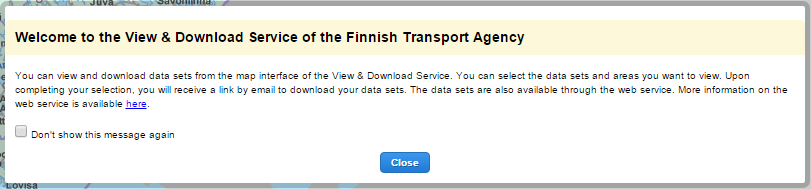

# LaKaPa Startup Info

<table class="table">
  <tr>
    <td>ID</td><td>StartupInfoBundle</td>
  </tr>
</table>

## Description

This bundle provides a user start up info.

## Screenshot

## Bundle configuration

No configuration is required.

## Bundle state

No statehandling has been implemented.

## Requests the bundle handles

This bundle doesn't handle any requests.

## Requests the bundle sends out

This bundle doesn't send any requests.

## Events the bundle listens to

This bundle doesn't list any events.

## Events the bundle sends out

This bundle doesn't send any events.

## Dependencies

<table class="table">
  <tr>
    <th>Dependency</th><th>Linked from</th><th>Purpose</th>
  </tr>
  <tr>
    <td>[jQuery](http://api.jquery.com/)</td>
    <td>Assumes to be linked in the page</td>
    <td>Used to create the component UI from begin to end</td>
  </tr>
</table>
