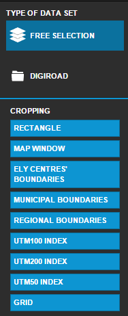

# LaKaPa Transport Selector

<table class="table">
  <tr>
    <td>ID</td><td>LakapaTransportSelector</td>
  </tr>
</table>

## Description

This bundle provides a transport selector menu and tranport layer showing/hiding.

## Screenshot



## Bundle configuration

Configuration is required.

```javascript
"selector": {
  "transport_cropping_areas": {
    "railway": {
      "lasRegular": "",
      "areaLimitInSquareMeters": "6000000000000",
      "options": ["newreqular","mapextent"]
    },
    "sea": {
      "lasRegular": "",
      "areaLimitInSquareMeters": "6000000000000",
      "options": ["newreqular","mapextent"]
    },
    "road": {
      "lasRegular": "",
      "areaLimitInSquareMeters": "6000000000000",
      "options": ["newreqular","mapextent"]
    }
  },
  "selectedFillOpacity": 0.6,
  "transport-activate-layers": {
    "digiroad": [],
    "railway": [],
    "sea": [],
    "road": [],
    "beta": []
  },
  "transport_layers": {
    "digiroad": [],
    "railway": [],
    "sea": [],
    "road": [],
    "beta": []
  },
  "selected_transport": "road",
  "selectedFillColor": "#0B719E",
  "transport_cropping_layers": {
    "digiroad": [],
    "road": []
  }
},
"maakuntarajatNimi": "",
"digiroadMaxFileSize": 300,
"user": {}
```

## Bundle state

No statehandling has been implemented.

## Requests the bundle handles

<table class="table">
  <tr>
    <th>Request</th><th>Where/why it's used</th>
  </tr>
  <tr>
    <td>`HideSelectionRequest`</td><td>Hide selection on the map</td>
  </tr>
  <tr>
    <td>`ShowBoundingBoxRequest`</td><td>Show bounding box on the map</td>
  </tr>
  <tr>
    <td>`ShowFeatureRequest`</td><td>Show feature on the map</td>
  </tr>
  <tr>
    <td>`ShowMessageRequest`</td><td>Show message</td>
  </tr>
  <tr>
    <td>`ToggleTransportSelectorRequest`</td><td>Toggle transport</td>
  </tr>
</table>

## Requests the bundle sends out

<table class="table">
  <tr>
    <th>Request</th><th>Where/why it's used</th>
  </tr>
  <tr>
    <td>`AddToBasketRequest`</td><td>Add item to basket</td>
  </tr>
  <tr>
    <td>`ChangeLanguageRequest`</td><td>Change language</td>
  </tr>
  <tr>
    <td>`TransportChangedRequest`</td><td>Send transport changed</td>
  </tr>
  <tr>
    <td>`AddMapLayerRequest`</td><td>Add layer to map request</td>
  </tr>
  <tr>
    <td>`RemoveMapLayerRequest`</td><td>Remove layer from map</td>
  </tr>
  <tr>
    <td>`RefreshLiviBasketRequest`</td><td>Refresh basket</td>
  </tr>
  <tr>
    <td>`userinterface.AddExtensionRequest`</td><td>Register as part of the UI in start()-method.</td>
  </tr>
  <tr>
    <td>`userinterface.RemoveExtensionRequest`</td><td>Unregister from the UI in stop()-method.</td>
  </tr>
</table>

## Events the bundle listens to

<table class="table">
  <tr>
    <th>Event</th><th>How does the bundle react</th>
  </tr>
  <tr>
    <td>`userinterface.ExtensionUpdatedEvent`</td>
    <td>Listens to `lakapa-transpor-selector` Flyout opens/closes</td>
  </tr>
</table>

## Events the bundle sends out

This bundle doesn't send any events.

## Dependencies

<table class="table">
  <tr>
    <th>Dependency</th><th>Linked from</th><th>Purpose</th>
  </tr>
  <tr>
    <td>[jQuery](http://api.jquery.com/)</td>
    <td>Assumes to be linked in the page</td>
    <td>Used to create the component UI from begin to end</td>
  </tr>
</table>
