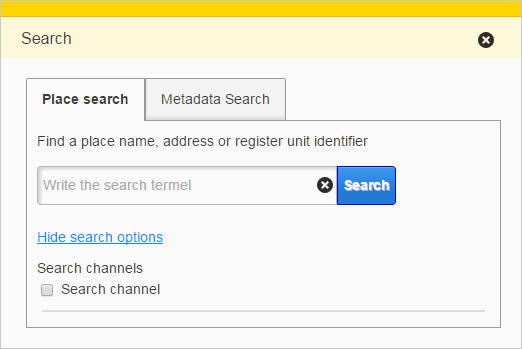

# Search From Channels

<table class="table">
  <tr>
    <td>ID</td><td>search-from-channels</td>
  </tr>
</table>

## Description

This bundle provides a new search tab. 
In additional options user can select a channel which to search.

## Screenshot

## Bundle configuration

No configuration is required.

## Bundle state

No statehandling has been implemented.

## Requests the bundle handles

This bundle doesn't handle any requests.

## Requests the bundle sends out

<table class="table">
  <tr>
    <th> Request </th><th> Where/why it's used</th>
  </tr>
  <tr>
    <td>`MapMoveRequest`</td><td> Move map to selected coordinates.</td>
  </tr>
  <tr>
    <td>`MapModulePlugin.RemoveFeaturesFromMapRequest`</td><td> Remove search result features from map.</td>
  </tr>
  <tr>
    <td>`MapModulePlugin.AddFeaturesToMapRequest`</td><td> Add search result features to map.</td>
  </tr>
  <tr>
    <td>`userinterface.RemoveExtensionRequest`</td><td> Remove extension.</td>
  </tr>
  <tr>
    <td>`InfoBox.HideInfoBoxRequest`</td><td> Hide infobox.</td>
  </tr>
</table>

## Events the bundle listens to

<table class="table">
  <tr>
    <th>Event</th><th>How does the bundle react</th>
  </tr>
  <tr>
    <td>`userinterface.ExtensionUpdatedEvent`</td>
    <td>Listens to `search-from-channels` Flyout opens/closes</td>
  </tr>
</table>

## Events the bundle sends out

This bundle doesn't send any events.

## Dependencies

<table class="table">
  <tr>
    <th>Dependency</th><th>Linked from</th><th>Purpose</th>
  </tr>
  <tr>
    <td>[jQuery](http://api.jquery.com/)</td>
    <td>Assumes to be linked in the page</td>
    <td>Used to create the component UI from begin to end</td>
  </tr>
</table>
