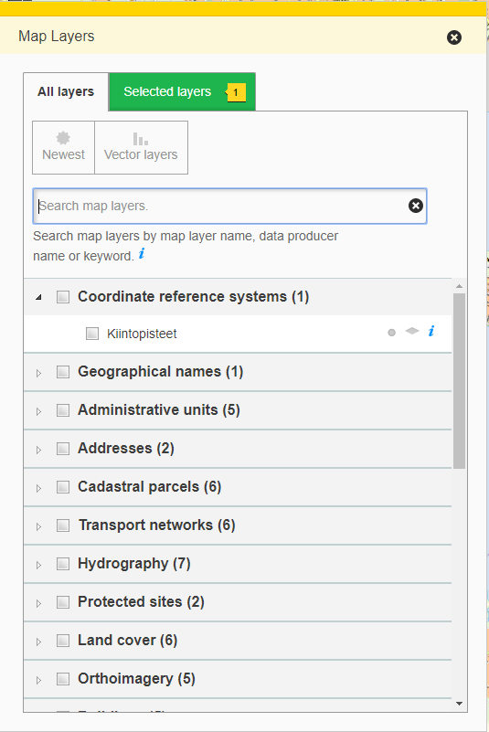

# hierarchical-layerlist

A hierarchical layerlist for handling deeper hierarchy with layers. Combines the functionality of layerselector2 and layerselection2 bundles.

## Description

This bundle combines the functionality of layerselector2 and layerselection2 bundles. Also service can add more tools for grousp (and subgroups) and also layers.

## Screenshot

## Bundle configuration

No configuration is required.

## Bundle state

No state is required.

## Requests the bundle sends out

<table class="table">
<tr>
  <th> Request </th>
  <th> Where/why it's used</th>
</tr>
<tr>
  <td> `MapModulePlugin.MapLayerVisibilityRequest` </td>
  <td>Sends out when user clicks the 'Show/Hide' link on a layer</td>
</tr>
<tr>
  <td> `RemoveMapLayerRequest` </td>
  <td>Sends out when user clicks the 'remove map layer' button</td>
</tr>
<tr>
  <td> `ChangeMapLayerStyleRequest` </td>
  <td>Sent when a layer style is selected from the dropdown.</td>
</tr>
<tr>
  <td> `ChangeMapLayerOpacityRequest` </td>
  <td>Sends out when user changes the opacity for a layer</td>
</tr>
<tr>
  <td> `MapModulePlugin.MapMoveByLayerContentRequest` </td>
  <td> Allows the user to move the map by the layer content</td>
</tr>
<tr>
  <td> `userinterface.UpdateExtensionRequest` </td>
  <td> Handles flyout hide/show </td>
</tr>
<tr>
  <td> `userinterface.AddExtensionRequest` </td>
  <td>Register as part of the UI in start()-method</td>td>
</tr>
<tr>
  <td> `userinterface.RemoveExtensionRequest` </td>
  <td>Unregister from the UI in stop()-method</td>
</tr>
<tr>
  <td> `Guidedtour.AddToGuidedTourRequest` </td>
  <td> Register layerlist to guided tour </td>
</tr>
<tr>
  <td> `catalogue.ShowMetadataRequest` </td>
  <td>Sent when the the info icon is clicked</td>
</tr>
<tr>
  <td> `ShowMapLayerInfoRequest` </td>
  <td>Sent when the the backend status icon is clicked<td>
</tr>
<tr>
  <td> `RearrangeSelectedMapLayerRequest` </td>
  <td>Sends out when user changes the order of layers in the list</td>
</tr>

</table>

## Events the bundle listens to

<table class="table">
  <tr>
    <th>Event</th><th>Why/when</th>
  </tr>
  <tr>
    <td> `AfterMapLayerRemoveEvent` </td><td> Removes layer from selected tab and also unchecks layer checkboxes</td>
  </tr>
  <tr>
    <td> `AfterMapLayerAddEvent` </td><td>Add layer to selected tab and also checks layer checkboxes</td>
  </tr>
  <tr>
    <td> `MapLayerEvent` </td><td>Only listens to 'update' operation and updates the name of the layer in UI</td>
  </tr>
  <tr>
    <td> `BackendStatus.BackendStatusChangedEvent` </td><td>Changes layer backend status icons</td>
  </tr>
  <tr>
    <td> `userinterface.ExtensionUpdatedEvent` </td><td>React flyout updates</td>
  </tr>
  <tr>
    <td> `MapLayerVisibilityChangedEvent` </td><td>Changes the UI for the layer</td>
  </tr>
  <tr>
    <td> `AfterChangeMapLayerOpacityEvent` </td><td>Changes map layer opacity slider values</td>
  </tr>
  <tr>
    <td> `AfterChangeMapLayerStyleEvent` </td><td>Changes map layer style</td>
  </tr>
  <tr>
    <td> `AfterRearrangeSelectedMapLayerEvent` </td><td>Changes map layer arrange</td>
  </tr>
  <tr>
    <td> `MapSizeChangedEvent` </td><td>Handles flyout max height</td>
  </tr>

</table>
