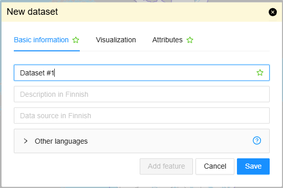
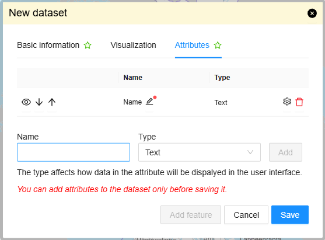

# MyFeatures

Provides tools for managing a user's feature layers and their features.

## Description





The bundle loads the logged-in user's MyFeatures layers and makes them available as map layers.
Users can create layers, import data, edit layer metadata and styles, export layers, and add or
edit individual features. When the `mydata` bundle is available, MyFeatures adds a tab there to
list the user's layers.

The bundle's layer and feature operations use the Oskari-server routes `MyFeaturesLayer`,
`ImportMyFeatures`, `ExportMyFeaturesLayer`, and `MyFeaturesFeature`.

## Bundle configuration

Configuration is optional:

```javascript
conf: {
  maxFileSizeMb: 10
}
```

- `maxFileSizeMb` sets the maximum import file size in megabytes. The default is 10 MB.
- The maximum unzipped size for an import is 15 times `maxFileSizeMb`.

The bundle loads the user's layers and enables its toolbar tools only when the user is logged in.

## Requests the bundle sends out

<table class="table">
<tr>
  <th> Request </th>
  <th> Where/why it's used </th>
</tr>
<tr>
  <td> `Toolbar.AddToolButtonRequest` </td>
  <td> Adds toolbar buttons for importing/creating a layer and adding a feature, when the request builder is available. The buttons are disabled for guest users. </td>
</tr>
<tr>
  <td> `AddMapLayerRequest` </td>
  <td> Adds an imported layer or a layer selected from the MyFeatures list to the map. </td>
</tr>
<tr>
  <td> `MapModulePlugin.MapLayerUpdateRequest` </td>
  <td> Refreshes a layer on the map after its features or layer settings change. </td>
</tr>
<tr>
  <td> `ChangeMapLayerStyleRequest` </td>
  <td> Applies the updated style to a selected layer after its settings change. </td>
</tr>
<tr>
  <td> `RemoveMapLayerRequest` </td>
  <td> Removes a deleted layer from the map. </td>
</tr>
<tr>
  <td> `InfoBox.HideInfoBoxRequest` </td>
  <td> Closes the feature deletion confirmation from the infobox when deletion is confirmed. </td>
</tr>
</table>

## Events the bundle listens to

<table class="table">
<tr>
  <th> Event </th>
  <th> How does the bundle react </th>
</tr>
<tr>
  <td> `MapLayerEvent` </td>
  <td> Refreshes the MyFeatures layer list when a layer is added, updated, or removed. </td>
</tr>
</table>

## Dependencies

<table class="table">
<tr>
  <th> Dependency </th>
  <th> Linked from </th>
  <th> Purpose </th>
</tr>
<tr>
  <td> `MapLayerService` </td>
  <td> Oskari sandbox </td>
  <td> Registers and manages MyFeatures map layers. </td>
</tr>
<tr>
  <td> WFS layer plugin </td>
  <td> Main map module </td>
  <td> Handles the MyFeatures layer type on the map. </td>
</tr>
<tr>
  <td> `mydata` </td>
  <td> Oskari sandbox (optional) </td>
  <td> Provides the tab in which the user's MyFeatures layers are listed. </td>
</tr>
</table>