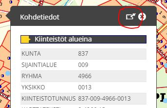
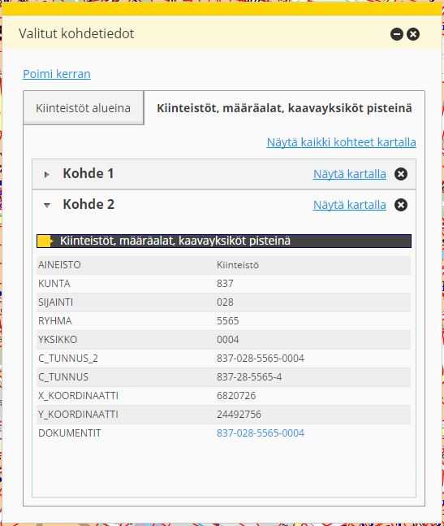

# Selected-featuredata

Allows infobox opening in new flyout

## Description

This Bundle provides functionality that opens infobox content into flyout. User can click several features from the map and this bundle
collects all data into one flyout. Bundle uses Tab module into different layers and Accordion module for different features. User can show
features on map later on.

## Screenshot

### Start using infobox flyout

### Selected-featuredata bundle

## Bundle configuration

No configuration needed

## Bundle state

No statehandling has been implemented.

## Requests the bundle sends out
<table class="table">
<tr>
  <th> Request </th><th> Where/why it's used</th>
</tr>
<tr>
  <td> userinterface.AddExtensionRequest </td><td> Restore flyout if oskari-minimized.</td>
</tr>
<tr>
  <td> userinterface.RemoveExtensionRequest </td><td> Unregister from the UI in stop()-method.</td>
</tr>
<tr>
  <td> AddMapLayerRequest </td><td> If any layer is marked for promotion, the user can add it from the publisher. When the publisher is closed, adds any layers that were removed because user didn't have publish rights.</td>
</tr>
<tr>
  <td> MapMoveRequest </td><td> Move map to certain place by x and y</td>
</tr>
<tr>
  <td> MapModulePlugin.AddMarkerRequest </td><td> Adds marker on map by x and y.</td>
</tr>
<tr>
  <td> MapModulePlugin.RemoveMarkersRequest </td><td> Removes marker from map.</td>
</tr>
<tr>
  <td> RemoveMapLayerRequest </td><td> If promoted layer is added via publisher, it can be removed as well. Also removes layers from selection that the user can't publish</td>
</tr>
<tr>
  <td> userinterface.UpdateExtensionRequest </td><td> Requests close on the flyout when publisher is closed and close to any other flyout when the publisher is opened.</td>
</tr>
<tr>
  <td> AddLayerListFilterRequest </td><td> Requests add publishable filter to layerselector2 bundle.</td>
</tr>
</table>

## Events the bundle sends out
<table>
  <tr>
    <th>Event</th><th>Where/why it's used</th>
  </tr>
  <tr>
    <td>WFSFeaturesSelectedEvent</td><td>Event is for wfs highlight</td>
  </tr>
</table>

## Events the bundle listens to

<table class="table">
  <tr>
    <th> Event </th><th> How does the bundle react</th>
  </tr>
  <tr>
    <td> AfterMapLayerAddEvent </td><td> Updates the flyout to reflect current maplayer selections</td>
  </tr>
  <tr>
    <td> AfterMapLayerRemoveEvent </td><td> Updates the flyout to reflect current maplayer selections</td>
  </tr>
  <tr>
    <td> MapClickedEvent </td><td> Removes tabs from flyout if user has selected "collect only once"</td>
  </tr>
  <tr>
    <td> userinterface.ExtensionUpdatedEvent </td><td> Determines if the layer was closed or opened and enables/disables preview view accordingly</td>
  </tr>
</table>

## Dependencies

<table class="table">
  <tr>
    <th> Dependency </th><th> Linked from </th><th> Purpose </th>
  </tr>
  <tr>
    <td> [jQuery](http://api.jquery.com/) </td>
    <td> Linked in portal theme </td>
    <td> Used to create the component UI from begin to end</td>
  </tr>
  <tr>
    <td> [Oskari divmanazer](/documentation/bundles/framework/divmanazer) </td>
    <td> Uses flyout minify from divmanazer </td>
    <td> Needed for flyout functionality</td>
  </tr>
</table>