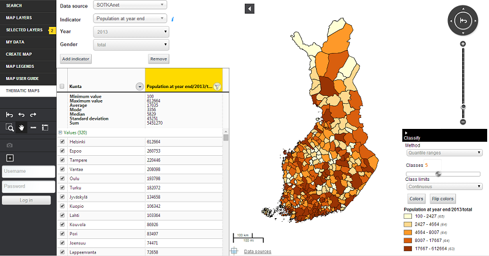

# statsgrid

Statistics data display.

## Description

Bundle fetches data from the [SOTKAnet](http://uusi.sotkanet.fi/portal/page/portal/etusivu) statistics and indicator bank and displays the data in a grid and visualizes it on the map. Users can select different indicators from a menu and classify the data in multiple ways, including specifying class breaks by hand (manual breaks).

The grid and the classifier are initialized as plugins so they can be used individually as well. They both use the StatisticsService to send events and make the actual AJAX calls to fetch the data.

Grid section: selected regions will be visualized on the map.
Map section: selected regions are hilighted in the grid.
Select hilighted mode: selected regions (map) are also selected in the grid.

Each data column has a menu from where the user can filter the values in the grid and on the map. Filtering is possible based on values (equals, greater than etc.) or regions (at the moment regions from the SOTKANet service are supported. Refer to the REST API documentation [here](http://uusi.sotkanet.fi/portal/pls/portal/!PORTAL.wwpob_page.show?_docname=26001.HTML) (only in Finnish)).

## Screenshot



## TODO

* remove hilighted borders when going away from select hilighted mode
* selected grid items should be sent somehow to statsplugin.

## Bundle configuration

* `defaultLayerId` is optional, the first registered layer of type `statslayer` will be used if not configured
* `tileClazz` is optional and will add a tile to menu for easier access if configured
* `sandbox` is optional, uses the default sandbox if not configured

```javascript
"config" : {
    "name" : "StatsGrid",
    "sandbox" : "sandbox",
    "stateful" : true,
    "tileClazz" : "Oskari.statistics.bundle.statsgrid.Tile",
    "viewClazz" : "Oskari.statistics.bundle.statsgrid.StatsView"
    "defaultLayerId": 274
}
```

Configuration for `ManageStatsPlugin`:
```javascript
"config" : {
  "state" : <following keys are the same as in bundle state: layerId, indicators, currentColumn (optional, defaults to an empty object)>,
  "layer" : <id of the layer where the visualizations should be applied to (optional, defaults to null)>,
  "published" : <true for a published map so the indicators selection is not included (optional, defaults to false)>
}
```

## Bundle state

```javascript
state : {
  layerId : "<id of the stats layer>",
  indicators : "<array of indicators>",
  currentColumn : "<selected indicator>",
  methodId : "<id of the selected classification method>",
  numberOfClasses : "<number of classification classes>",
  manualBreaksInput : "<input string for the manual breaks classification method>",
  regionCategory : "<selected region category, eg. municipalities>"
}
```

## Requests the bundle sends out

<table class="table">
  <tr>
    <th>Request</th><th>Why/when</th>
  </tr>
  <tr>
    <td>userinterface.AddExtensionRequest</td><td>Extends the basic view.</td>
  </tr>
</table>

### ManageStatsPlugin

<table class="table">
  <tr>
    <th>Request</th><th>Why/when</th>
  </tr>
  <tr>
    <td>MapModulePlugin.MapLayerVisibilityRequest</td><td>Shows/hides the layer when necessary.</td>
  </tr>
</table>

## Events the bundle listens to

<table class="table">
  <tr>
    <th>Event</th><th>How does the bundle react</th>
  </tr>
  <tr>
    <td>userinterface.ExtensionUpdatedEvent</td>
    <td>Enters/exits the statistics mode.</td>
  </tr>
  <tr>
    <td>MapStats.StatsVisualizationChangeEvent</td>
    <td>Saves params from the event to the bundle state.</td>
  </tr>
  <tr>
    <td>AfterMapMoveEvent</td>
    <td>Updates parameters for the printout bundle.</td>
  </tr>
  <tr>
    <td>AfterMapLayerRemoveEvent</td>
    <td>Exits the statistics mode.</td>
  </tr>
</table>

### ManageClassificationsPlugin

<table class="table">
  <tr>
    <th>Event</th><th>How does the bundle react</th>
  </tr>
  <tr>
    <td>MapLayerEvent</td>
    <td>Shows the classification UI</td>
  </tr>
  <tr>
    <td>AfterMapLayerRemoveEvent</td>
    <td>Removes the classification UI</td>
  </tr>
  <tr>
    <td>AfterMapLayerAddEvent</td>
    <td>Shows the classification UI</td>
  </tr>
  <tr>
    <td>MapLayerVisibilityChangedEvent</td>
    <td>Shows/removes the classification UI depending on the param</td>
  </tr>
  <tr>
    <td>StatsGrid.SotkadataChangedEvent</td>
    <td>Classifies the data and sends an event to visualize it on the map</td>
  </tr>
  <tr>
    <td>StatsGrid.SelectHilightsModeEvent</td>
    <td>Activates mode (isSelectHilightedMode)</td>
  </tr>
  <tr>
    <td>StatsGrid.ClearHilightsEvent</td>
    <td>Deactivates mode (isSelectHilightedMode)</td>
  </tr>
</table>

### ManageStatsPlugin

<table class="table">
  <tr>
    <th>Event</th><th>How does the bundle react</th>
  </tr>
  <tr>
    <td>MapStats.FeatureHighlightedEvent</td>
    <td>Highlights the given feature in the grid.</td>
  </tr>
</table>

## Dependencies

<table class="table">
  <tr>
    <th>Dependency</th><th>Linked from</th><th>Purpose</th>
  </tr>
  <tr>
    <td> [OpenLayers](http://openlayers.org/) </td>
    <td> Expects OpenLayers already to be linked </td>
    <td> To modify map</td>
  </tr>
  <tr>
    <td> [Oskari mapmodule](/documentation/bundles/framework/mapmodule)</td>
    <td> Expects to be present in the application setup </td>
    <td> To gain control to OpenLayers map</td>
  </tr>
  <tr>
    <td> [Oskari mapstats](/documentation/bundles/framework/mapstats)</td>
    <td> Expects to be present in the application setup</td>
    <td> Needed to support the STATS layer type.</td>
  </tr>
  <tr>
    <td> [geostats](http://www.empreinte-urbaine.eu/mapping/geostats/)</td>
    <td> Linked dynamically from /Oskari/libraries/geostats</td>
    <td> Needed for the classifications of the data</td>
  </tr>
</table>
