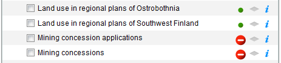

# backendstatus

## Description

Polls a backend system for map layers monitoring statuses and informs interested parties via an event.

## Screenshot

## Bundle configuration

No configuration is required.

## Bundle state

No statehandling has been implemented.

## Requests the bundle handles

This bundle doesn't handle any requests.

## Requests the bundle sends out

This bundle doesn't send out any requests.

## Events the bundle listens to

<table class="table">
  <tr>
    <th>Event</th><th>How does the bundle react</th>
  </tr>
  <tr>
    <td>`userinterface.ExtensionUpdatedEvent`</td>
    <td>Listens to `layerselector2` Flyout opens/closes</td>
  </tr>
  <tr>
    <td>`AfterShowMapLayerInfoEvent`</td>
    <td>Displays a status dialog or a warning if status not available</td>
  </tr>
  <tr>
    <td>`MapLayerEvent`</td>
    <td>Updates the backend statuses</td>
  </tr>
</table>

## Dependencies

<table class="table">
  <tr>
    <th>Dependency</th><th>Linked from</th><th>Purpose</th>
  </tr>
  <tr>
    <td>`jQuery`</td>
    <td>Assumes to be linked in the page</td>
    <td>Sends the ajax call to the backend</td>
  </tr>
  <tr>
    <td>`framework/divmanazer`</td>
    <td>Assumes to be present in the application setup</td>
    <td>User interface</td>
  </tr>
</table>
