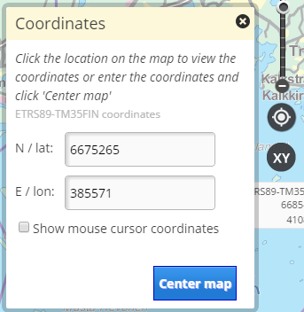
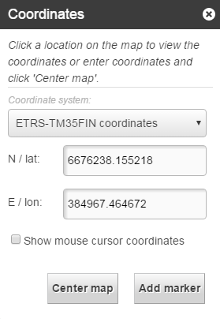

# coordinatetool

## Description

This bundle provides a plugin (Oskari.mapframework.bundle.coordinatetool.plugin.CoordinateToolPlugin) for mapmodule that can:
* shows coordinates on mouse location
* shows coordinates on mouse map click
* center map to given coordinates
* add marker with given coordinates
* as optional functionality coordinate transformation form one coordinate system to another can be added to the coordinatetool (configuration is needed)


## Screenshot





## Bundle configuration

No configuration is required, but there is few possible configurations:

- Setting `projectionShowFormat` to configure how different projections are showed in textfields. This setting supports all projections or projection specific configuration. In both of these `metric` property define decimal plates (if format is `degrees` then this seconds is rounded to wanted decimals), `format` property define showed format (`degrees` or `metric`). If not setted then metric format and 0 decimals are default. if projectionShowFormat not defined then using map units and this decimals.
  - Option to change all projections formats
````
{
        "format": "degrees",
        "decimals": 4
}
````
  - Option to different projections
````
{
        "EPSG:4258": {
            "format": "degrees",
            "decimals": 4
          },
        "EPSG:3067": {
            "format": "metric",
            "decimals": 0
        }
}
````
  - Or you can also define defaults and override some projections. Projection defination overrides defaults.
````
{
        "format": "degrees",
        "decimals": 4,
        "EPSG:3067": {
            "format": "metric",
            "decimals": 0
        }
}
````

- Option to configure coordinatetool to show reverse geocode for the current position
  ( bundle config in the view in portti_view_bundle_seq table)
````
{
      "isReverseGeocode": true,
      "reverseGeocodingIds": "WHAT3WORDS_CHANNEL"
}
````

- Option to configure XY reference system changing functions  (CRS code and view uuid,..)
````
{
      "supportedProjections": {
          "EPSG:3035": "482333d1-f0d0-4410-aa65-60db4e45b853",
          "EPSG:3857": "1d65e6cc-4ac7-4dab-8a94-76b3dd632307"
      }
}
````

- Option to configure coordinate transformation tool:
````
{
      "supportedProjections": [
        "EPSG:3067", "NLSFI:etrs_gk", "NLSFI:ykj",
        "EPSG:4258", "LATLON:kkj", "EPSG:3046",
        "EPSG:3048", "EPSG:3873", "EPSG:3874",
        "EPSG:3875", "EPSG:3876", "EPSG:3877",
        "EPSG:3878", "EPSG:3879", "EPSG:3880",
        "EPSG:3881", "EPSG:3882", "EPSG:3883",
        "EPSG:3884", "EPSG:3885"
      ]
}
````

- Option to configure XY-icon not visible (for example coordinatetools is used in published map and it's opened/closed by RPC request):
````
{
    "noUI": true
}
````

- Option to configure to show emergency call message:
````
{
    "showEmergencyCallMessage" : true
}
````

## Requests the bundle sends out

<table class="table">
  <tr>
    <th> Request </th><th> Where/why it's used</th>
  </tr>
  <tr>
    <td>`MapMoveRequest`</td><td> Move map to selected coordinates.</td>
  </tr>
</table>


## Events the bundle listens to

<table class="table">
  <tr>
    <th>Event</th><th>How does the bundle react</th>
  </tr>
  <tr>
    <td>`MouseHoverEvent`</td><td>Updates the coordinates gotten from event to the UI.</td>
  </tr>
  <tr>
    <td>`AfterMapMoveEvent`</td><td>Updates the updated coordinates for map center.</td>
  </tr>
  <tr>
    <td>`MapClickedEvent`</td><td>Updates the coordinates gotten from event to the UI.</td>
  </tr>
  <tr>
    <td>`Publisher.ColourSchemeChangedEvent`</td><td>Updates the UI colour schema from event.</td>
  </tr>
  <tr>
    <td>`Publisher2.ColourSchemeChangedEvent`</td><td>Updates the UI colour schema from event.</td>
  </tr>

</table>

## Dependencies

<table class="table">
  <tr>
    <th>Dependency</th><th>Linked from</th><th>Purpose</th>
  </tr>
  <tr>
    <td>[jQuery](http://api.jquery.com/)</td>
    <td>Assumes to be linked in the page</td>
    <td>Used to create the component UI from begin to end</td>
  </tr>
</table>
