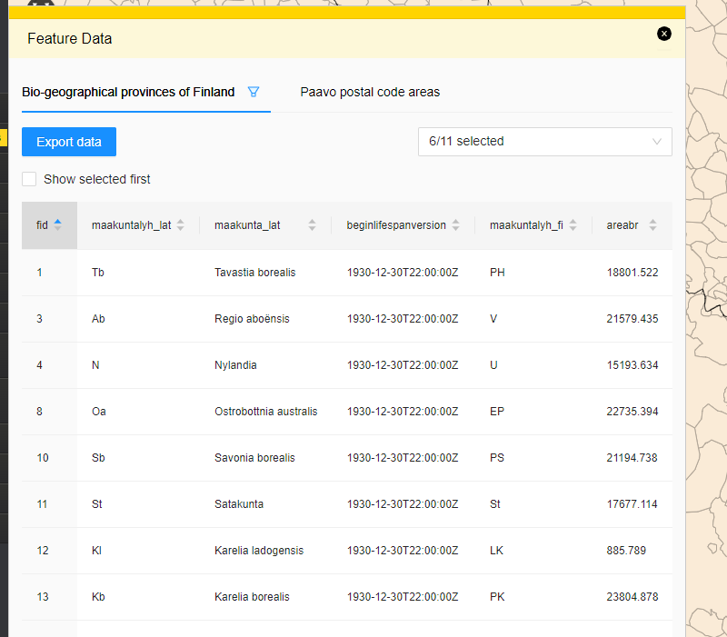

# featuredata

## Description

The Bundle provides a grid view for WFS object data.

## Screenshot



## Bundle configuration

No configuration is required, but there are two possible configurations:

```javascript
{
  "selectionTools" : true,
  "disableExport" : true
}
```

Setting selectionTools to true will add a new button to toolbar that opens a selection tool dialog. Using selection tools the user can select features by drawing point or area. Features that are inside or intersect the drawn area are selected.

Setting disableExport to true will remove Export button from the feature data grid and thereby will disable exporting of feature data.

## Requests the bundle sends out

<table class="table">
  <tr>
    <th>Request</th><th> Where/why it's used</th>
  </tr>
  <tr>
    <td>userinterface.AddExtensionRequest</td><td> Register as part of the UI in start()-method</td>
  </tr>
  <tr>
    <td>Toolbar.AddToolButtonRequest</td><td> Requests selection toolbar button</td>
  </tr>
  <tr>
    <td> userinterface.RemoveExtensionRequest </td><td> Unregister from the UI in stop()-method</td>
  </tr>
  <tr>
    <td> map.layer.activation </td><td> Requests that a layer is activated/"highlighted" (old mechanic) so highlighting and feature selection will occur using this layer. Sent when a tab is selected or unselected (tab presents one layers data)</td>
  </tr>
  <tr>
    <td> userguide.ShowUserGuideRequest </td><td> Used to show additional data that wouldn't fit the normal grid. A link is shown instead on grid and clicking the link will open the additional data on user guide "popup".</td>
  </tr>
</table>

## Events the bundle listens to

<table class="table">
<tr>
  <th> Event </th><th> How does the bundle react</th>
</tr>
<tr>
  <td> AfterMapLayerAddEvent </td><td> A tab panel is added to the flyout for the added layer.</td>
</tr>
<tr>
  <td> AfterMapLayerRemoveEvent </td><td> Tab panel presenting the layer is removed from the flyout.</td>
</tr>
<tr>
  <td> WFSPropertiesEvent </td><td> Grid data is updated if the flyout is open. Data is only updated for the layer whose tab is currently selected.</td>
</tr>
<tr>
  <td> WFSFeatureEvent </td><td> Grid data is updated if the flyout is open. Data is only updated for the layer whose tab is currently selected.</td>
</tr>
<tr>
  <td> WFSFeaturesSelectedEvent </td><td> Highlights the feature on the grid.</td>
</tr>
<tr>
  <td> userinterface.ExtensionUpdatedEvent </td><td> Determines if the layer was closed or opened and enables/disables data updates accordingly.</td>
</tr>
<tr>
  <td> WFSStatusChangedEvent </td><td> Shows a loading/error indicator on UI based on WFS process status changes.</td>
</tr>
</table>

## Dependencies

<table class="table">
  <tr>
    <th> Dependency </th><th> Linked from </th><th> Purpose</th>
  </tr>
  <tr>
    <td> [jQuery](http://api.jquery.com/) </td>
    <td> Linked in portal theme </td>
    <td> Used to create the component UI from begin to end</td>
  </tr>
  <tr>
    <td> [Oskari toolbar](/documentation/bundles/framework/toolbar) </td>
    <td> Expects to be present in application setup </td>
    <td> To register plugin to toolbar</td>
  </tr>
</table>
