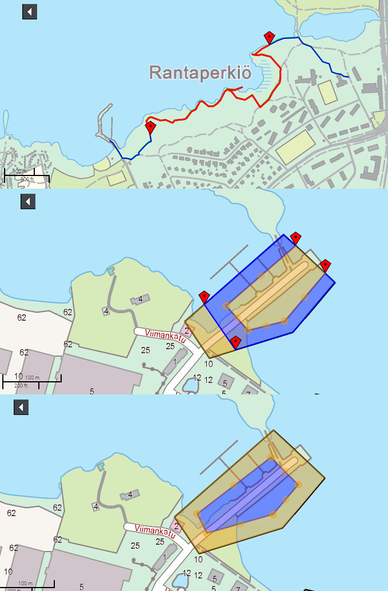

# geometryeditor

## Description

The bundle provides tools for geometry editing. Currently supported functionality includes line splitting with two markers and area splitting by another area or by dividing lines.

## Screenshot

## Bundle configuration

No configuration is required.

## Bundle state

No statehandling has been implemented.

## Requests the bundle handles

<table class="table">
  <tr>
    <th>Request</th><th> Where/why it's used</th>
  </tr>
  <tr>
    <td>DrawFilterPlugin.StartDrawFilteringRequest</td><td>Starts subgeometry filtering with the editor.</td>
  </tr>
  <tr>
    <td>DrawFilterPlugin.StopDrawFilteringRequest</td><td>Stops geometry editor.</td>
  </tr>
</table>

## Requests the bundle sends out

<table class="table">
  <tr>
    <th>Request</th><th> Where/why it's used</th>
  </tr>
  <tr>
    <td>MapModulePlugin.GetFeatureInfoActivationRequest</td><td>Enables or disables GFI popup functionality depending on the work flow.</td>
  </tr>
</table>

## Events the bundle listens to

This bundle doesn't listen to any events.

## Events the bundle sends out

<table class="table">
  <tr>
    <th> Event </th><th> When it is triggered/what it tells other components</th>
  </tr>
  <tr>
    <td> DrawFilterPlugin.FinishedDrawFilteringEvent </td><td> Sent when geometry editing is finished </td>
  </tr>
</table>

## Dependencies

<table class="table">
  <tr>
    <th> Dependency </th><th> Linked from </th><th> Purpose</th>
  </tr>
  <tr>
    <td> [OpenLayers](http://openlayers.org/) </td>
    <td> Version 2.13.1 assumed to be linked </td>
    <td> Used extensively for rendering map objects </td>
  </tr>
  <tr>
    <td> [JSTS](https://github.com/bjornharrtell/jsts) </td>
    <td> Version 0.13.4 assumed to be linked </td>
    <td> Used for geometrical operations </td>
  </tr>
  <tr>
    <td> [JavaScript Clipper](http://sourceforge.net/p/jsclipper/) </td>
    <td> Version 5.0.2.1 assumed to be linked </td>
    <td> Used for geometrical operations </td>
  </tr>
</table>
