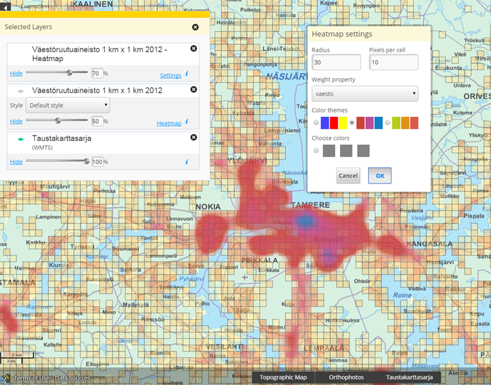

# heatmap

## Description

Adds heatmap functionality to layers configured to support it (WMS-layers only at the moment). Configuration is done by adding the following information to a layers JSON:

    {
        attributes : {
          geometryProperty : "the_geom",
          layerWorkspace : "ows",
          heatmap : ["properties to use", "as heatmap weighted property"]
        }
    }

SelectedLayers bundle will show heatmap-enabled layers with an additional "Heatmap" tool in the layer frame to access the functionality. Note! Generated SLD expects Geoserver as the WMS-service.

## Screenshot

## Bundle configuration

No configuration is required.

## Bundle state

No statehandling has been implemented.

## Requests the bundle handles

This bundle doesn't handle any requests.

## Requests the bundle sends out

This bundle doesn't send out any requests.

## Events the bundle listens to

<table class="table">
  <tr>
    <th>Event</th><th>Why/when</th>
  </tr>
  <tr>
    <td> MapLayerEvent </td><td> Adds heatmap tool to layer</td>
  </tr>
  <tr>
    <td> AfterMapLayerRemoveEvent </td><td>Removes layer from the map</td>
  </tr>
  <tr>
    <td> AfterChangeMapLayerOpacityEvent </td><td>Changes map layer opacity</td>
  </tr>
</table>

## Events the bundle sends out

This bundle doesn't send out any events.

## Dependencies

<table class="table">
  <tr>
    <th>Dependency</th><th>Linked from</th><th>Purpose</th>
  </tr>
  <tr>
    <td> [jQuery](http://api.jquery.com/) </td>
    <td> Linked in portal theme </td>
    <td> Used to create the component UI from begin to end</td>
  </tr>
  <tr>
    <td> [Spectrum Color Picker](https://bgrins.github.io/spectrum/) </td>
    <td> Heatmap bundle </td>
    <td> Used to select colors for heatmap</td>
  </tr>
</table>
