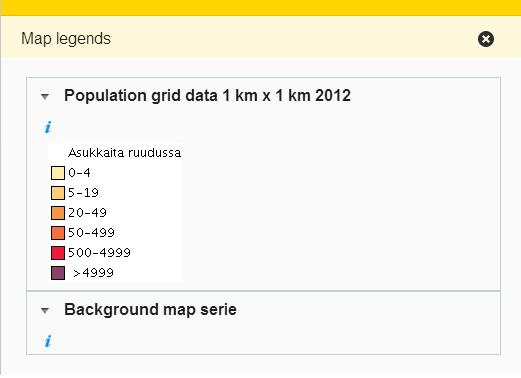

# maplegend

## Description

Displays legend images of selected map layers in a Flyout if the layers have legend image urls set.

## Screenshot

## Bundle configuration

No configuration is required.

## Bundle state

No statehandling has been implemented.

## Requests the bundle handles

This bundle doesn't handle any requests.

## Requests the bundle sends out

<table class="table">
  <tr>
    <th>Request</th><th>Why/when</th>
  </tr>
  <tr>
    <td>`userinterface.RemoveExtensionRequest`</td>
    <td>Unregisters the extensions (Flyout, Tile) when the bundle gets stopped</td>
  </tr>
</table>

## Events the bundle listens to

<table class="table">
  <tr>
    <th>Event</th><th>How does the bundle react</th>
  </tr>
  <tr>
    <td>`AfterMapLayerRemoveEvent`</td>
    <td>Refreshes the Flyout</td>
  </tr>
  <tr>
    <td>`AfterMapLayerAddEvent`</td>
    <td>Refreshes the Flyout</td>
  </tr>
  <tr>
    <td>`AfterChangeMapLayerStyleEvent`</td>
    <td>Refreshes the Flyout</td>
  </tr>
  <tr>
    <td>`MapLayerEvent`</td>
    <td>Refreshes the Flyout</td>
  </tr>
</table>

## Events the bundle sends out

This bundle doesn't send out any events.

## Dependencies

<table class="table">
  <tr>
    <th>Dependency</th><th>Linked from</th><th>Purpose</th>
  </tr>
  <tr>
    <td> [jQuery](http://api.jquery.com/) </td>
    <td> Version 1.7.1 assumed to be linked on the page</td>
    <td> Used to create the component UI from begin to end</td>
  </tr>
  <tr>
    <td> `divmanazer` </td>
    <td> Assumes to be present in the application setup</td>
    <td> Used to create the Flyout and the Tile</td>
  </tr>
</table>
