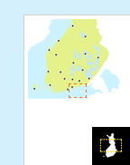

# Index Map

## Description

This plugin adds an indexmap for the map it is registered to.

## Screenshot


Closed



Open

## TO DO

The bundle is currently limited internationally, because Finland is hardcoded to the picture and extent.

## Bundle configuration

No configuration is required, in which case the indexmap appears on the lower right corner of the map by default. If there are many elements in the same location, variable 'position' defines the order of the elements. 


If you wish to change the location of the indexmap, you have two possibilities:

1) Define location on a map by configuring variables 'classes' and 'position'. Below are the default values.

```javascript
{
  "location" : {
        "classes" : "bottom right",
        "position" : 5
  }
};
```

2) Define container for the indexmap by configuring containerId.

```javascript
{
  "containerId" = "mycontainerId"
} 
```

## Requests the plugin handles

This plugin doesn't handle any requests.

## Requests the plugin sends out

This plugin doesn't sends any requests.

## Events the plugin listens to

<table class="table">
  <tr>
    <th> Event </th><th> How does the bundle react</th>
  </tr>
  <tr>
    <td> AfterMapMoveEvent </td><td> Updates ui to current map location</td>
  </tr>
</table>

## Events the plugin sends out

<table class="table">
  <tr>
    <th> Event </th><th> Why/When</th>
  </tr>
  <tr>
    <td> AfterMapMoveEvent </td><td> After map has moved within the indexmap</td>
  </tr>
</table>

## Dependencies

<table class="table">
  <tr>
    <th> Dependency </th><th> Linked from </th><th> Purpose</th>
  </tr>
  <tr>
    <td> [OpenLayers](http://openlayers.org/) </td>
    <td> not linked, assumes its linked by map </td>
    <td> Uses OpenLayers.Control.OverviewMap to render the index map.</td>
  </tr>
</table>
