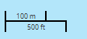

# Scale Bar

## Description

The plugin adds a scale bar to the map it is registered to.

## Screenshot

## Bundle configuration

No configuration is required.

## Requests the plugin handles

This plugin doesn't handle any requests.

## Requests the plugin sends out

This plugin doesn't sends any requests.

## Events the plugin listens to

<table class="table">
  <tr>
    <th>Event</th><th>How does the bundle react</th>
  </tr>
  <tr>
    <td>AfterMapMoveEvent</td><td>Updates ui to current zoom level</td>
  </tr>
</table>

## Events the plugin sends out

This bundle doesn't send any events.

## Dependencies

<table class="table">
  <tr>
    <th>Dependency</th><th>Linked from</th><th>Purpose</th>
  </tr>
  <tr>
    <td>[OpenLayers](http://openlayers.org/)</td>
    <td>not linked, assumes its linked by map</td>
    <td>Uses OpenLayers.Control.ScaleLine to render the scalebar.</td>
  </tr>
</table>
