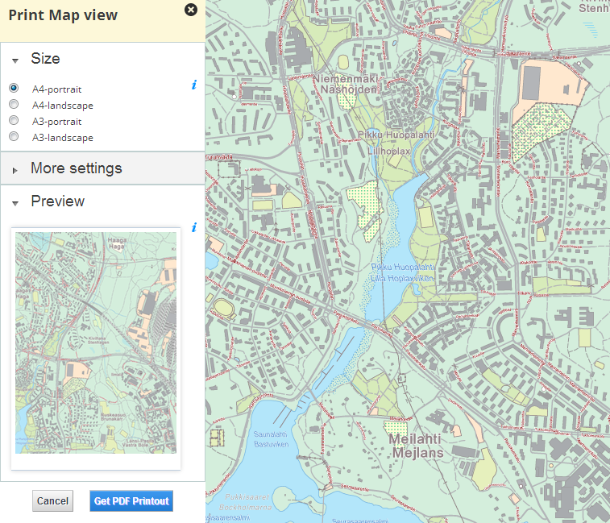

# Printout

## Description

Manages settings panel when user has entered to the print mode.

## Screenshot



## Bundle configuration

No configuration is required. Optional configuration is available for customized scale selection.

```javascript
{
    "scaleSelection": true,
    "scales": [500,1000,10000,25000,50000,100000]
}
```
* scaleSelection is to show scale selection (defaults to false)
* scales define custom scales for scale selection, if not defined defaults to map scales

## Requests the bundle handles

<table class="table">
  <tr>
    <th>Request</th><th>How does the bundle react</th>
  </tr>
  <tr>
    <td>printout.PrintMapRequest</td><td>Prints map with given selections</td>
  </tr>
</table>

## Requests the bundle sends out

<table class="table">
  <tr>
    <th>Request</th><th>Why/when</th>
  </tr>
  <tr>
    <td>DisableMapKeyboardMovementRequest</td><td>Disables keyboard listener for map movements</td>
  </tr><tr>
    <td>EnableMapKeyboardMovementRequest</td><td>Enables keyboard listener for map movements</td>
  </tr><tr>
    <td>userinterface.UpdateExtensionRequest</td><td>Bundle closes all flyouts when entering printing mode and its own flyouts when user clicks cancel button.</td>
  </tr>
</table>

## Events the bundle listens to

<table class="table">
  <tr>
    <th>Event</th><th>How does the bundle react</th>
  </tr>
  <tr>
    <td>AfterMapMoveEvent</td><td>Refresh print preview</td>
  </tr>
</table>

## Dependencies

<table class="table">
  <tr>
    <th>Dependency</th><th>Linked from</th><th>Purpose</th>
  </tr>
  <tr>
    <td>[jQuery](http://api.jquery.com/)</td><td>Linked in portal theme</td><td> Used to create the component UI from begin to end</td>
  </tr>
</table>
