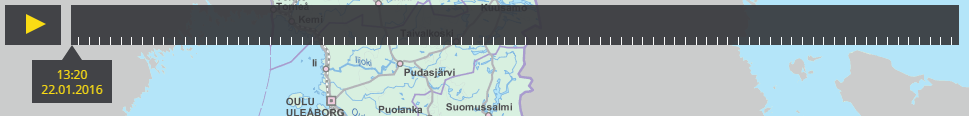

# Timeseries

- Adds generalized timeseries UI that any other bundle can use with TimeseriesService
- Adds support for registering layer animation implementations with TimeseriesLayerService (via TimeseriesService)
- Adds implementation for animating WMS layers (via TimeseriesLayerService)

## Screenshot



## Description

Bundles that handle timeseries data/functionality can register with TimeseriesService when they want to show a timeseries control UI. Only one timeseries control UI can be visible at once and TimeseriesService keeps track which one should be visible based on priority. Of different things that can have timeseries UI, layers have the lowest priority.

Bundles that define a new layer type, and which want to support animation, must register a class that will be instantiated for each timeseries enabled layer to implement the animation. This bundle itself registers a animator for "WMS" layers.

## Example - general case

Bundle that wants to show timeseries control UI can register with TimeseriesService:

```javascript
var timeseriesService = sandbox.getService('Oskari.mapframework.bundle.timeseries.TimeseriesService');

var id = 'sivcgeu'; // should be unique within "type"
var type = 'myTypeOfThing'; // arbitrary type for id
var priority = 23; // priority of registered thing, one with lowest priority across all registred things will be shown UI. Additionally type "layer" has lower priority than all other types
var delegate = ...; // Istance of a class that implements Oskari.mapframework.bundle.timeseries.TimeseriesDelegateProtocol. The UI communicates with your timeseries implementation via the delegate. Each separate "thing" that has timeseries state should have their own delegate instance that is registered to timeseriesService
var conf = {location: 'bottom center'}; // configuration given to TimeseriesControlPlugin when it's created with registered delegate.

timeseriesService.registerTimeseries(id, type, priority, delegate, conf);

```

To keep track which registered timeseries is currently active (has UI), for example to check if it's your bundle's timeseries:

```javascript
timeseriesService.on('activeChanged', function (active) {...});
```

And when the bundle wants to remove UI from view:

```javascript
timeseriesService.unregisterTimeseries(id, type);
```

## Example - new layer type

If the bundle wants to add support for timeseries functionality for a certain layer type (AbstractLayer.getLayerType()), it can register a factory function for creating timeseries delegates for that type:

```javascript
var timeseriesLayerService = sandbox.getService('Oskari.mapframework.bundle.timeseries.TimeseriesLayerService');
timeseriesLayerService.registerLayerType('<type of layer>', function(layerId) {
  return ...; // instantiate something implementing Oskari.mapframework.bundle.timeseries.TimeseriesDelegateProtocol and return it
});

```

After registering the new type, TimeseriesLayerService will create delegates automatically using the factory function for any layers of the given type that become selected.

## Bundle configuration

No configuration is required.


## Requests the bundle sends out

<table class="table">
  <tr>
    <th> Request </th><th> Where/why it's used</th>
  </tr>
  <tr>
    <td>MapModulePlugin.MapLayerUpdateRequest</td><td> When WMSAnimator changes the current TIME parameter in the WMS url</td>
  </tr>
</table>


## Events the bundle listens to

<table class="table">
  <tr>
    <th>Event</th><th>Why/when</th>
  </tr>
  <tr>
    <td> MapSizeChangedEvent </td><td> Resize timeseries UI to support different map window sizes </td>
  </tr>
  <tr>
    <td> AfterRearrangeSelectedMapLayerEvent </td><td>Show timeseries UI control for topmost timeseries enabled layer</td>
  </tr>
  <tr>
    <td> AfterMapLayerAddEvent </td><td>Show timeseries UI control for topmost timeseries enabled layer</td>
  </tr>
  <tr>
    <td> AfterMapLayerRemoveEvent </td><td>Show timeseries UI control for topmost timeseries enabled layer</td>
  </tr>
  <tr>
    <td> ProgressEvent </td><td>Track loading status of animating layer</td>
  </tr>
</table>
