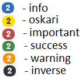

# Badge

## Description

A stylized element for showing values.

## Usage

```javascript
    var badge = Oskari.clazz.create('Oskari.userinterface.component.Badge');
    badge.insertTo( someElement );
    badge.setContent( someValue, "oskari" );
```
The second parameter in badge.setContent() is the style param.
i.e.
## Screenshot

