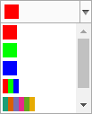

# ColorSelect

## Description

The color select component is defined in divmanazer bundle and provides a generic color select ui element.

## Screenshot



## How to use

Creates a color selection. Three first are single colors and then use many colors.

```javascript
var colorSelect = Oskari.clazz.create('Oskari.userinterface.component.ColorSelect');

colorSelect.setColorValues([
    'ff0000',
    '00ff00',
    '0000ff',
    ['ff0000', '00ff00', '0000ff'],
    ['1b9e77','d95f02','7570b3','e7298a','66a61e','e6ab02'],
    ['ffffb2','fed976','feb24c','fd8d3c','f03b20','bd0026']
]);
```

Sets handler for color selection. Handler gives the selected color index.
```javascript
colorSelect.setHandler(function(selected){
    console.log('Selected index: ' + selected);
});
```

Change color select visualization.
```javascript
colorSelect.setUIColors({
    hover: 'FF0000', // menu hover background color
    selected: '00FF00', // selected background color
    menu: '0000FF' // menu background color
});
```

Select wanted color index.
```javascript
colorSelect.setValue(0);
```

Inserts the button to given element.

```javascript
var myUI = jQuery('div.mybundle.colorselect');
colorSelect.insertTo(myUI);
```

Removes the color select.

```javascript
colorSelect.destroy();
```

## Dependencies

<table class="table">
  <tr>
    <th>Dependency</th><th>Linked from</th><th>Purpose</th>
  </tr>
  <tr>
    <td> [jQuery](http://api.jquery.com/) </td>
    <td> Version 1.7.1 assumed to be linked on the page</td>
    <td> Used to create the component UI from begin to end</td>
  </tr>
</table>
