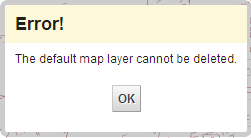

# Popup

## Description

The popup component is defined in divmanazer bundle and provides basic popup functionality. It can be used to show messages that will be shown for given time before removing and messages that user needs to react to by clicking a button. It can also be used in a modal mode (uses the Overlay component internally) and it can be used to show for example a form for user input. The popup can be associated with a given element so it will point at the element or as generic location on the middle of the screen.

## TODO

* Intelligent placement when associated to element so dialog doesn't go off-screen

## Screenshot



## How to use

Shows popup at the middle of the screen and closes automatically after 3 seconds. The fadeout method can be given the time as parameter but defaults to 3000 milliseconds.

```javascript
var dialog = Oskari.clazz.create('Oskari.userinterface.component.Popup');
dialog.show("Note", "Something happened");
dialog.fadeout();
```

Shows popup at the middle of the screen and closes when the user clicks the ok button on the popup. addClass is used to make the button visually "primary" (colored blue). `createCloseButton()` is a convenience method that just creates and returns a Oskari.userinterface.component.Button which is binded to close the dialog on click.

```javascript
var dialog = Oskari.clazz.create('Oskari.userinterface.component.Popup');
var btn = dialog.createCloseButton("OK");
btn.addClass('primary');
dialog.show("Note", "Click OK to close", [btn]);
```

Shows popup at the middle of the screen and closes when the user clicks the ok button on the popup. Here we create a custom `Oskari.userinterface.component.Button` and asign a handler function for it which closes the dialog and shows an alert. We also make the dialog modal by calling its `makeModal()` method.

```javascript
var dialog = Oskari.clazz.create('Oskari.userinterface.component.Popup');
var btn = dialog.createCloseButton("OK");
var alertBtn = Oskari.clazz.create('Oskari.userinterface.component.Button');

btn.addClass('primary');
alertBtn.setTitle('Alert');
alertBtn.setHandler(function() {
  dialog.close();
  alert('Alert');
});
dialog.show("Note", "Click OK to close and alert for an alert", [alertBtn, btn]);
dialog.makeModal();
```

Shows popup above (we give it alignment "top") a DOM element with id "myComponent" and closes automatically after 3 seconds.

```javascript
var dialog = Oskari.clazz.create('Oskari.userinterface.component.Popup');
dialog.show("Note", "Something happened at this component");
dialog.moveTo(jQuery('#myComponent'), 'top');
dialog.fadeout();
```

## Dependencies

<table class="table">
  <tr>
    <th>Dependency</th><th>Linked from</th><th>Purpose</th>
  </tr>
  <tr>
    <td> [jQuery](http://api.jquery.com/) </td>
    <td> Version 1.7.1 assumed to be linked on the page</td>
    <td> Used to create the component UI from begin to end</td>
  </tr>
  <tr>
    <td> [Oskari overlay component](/documentation/bundles/framework/divmanazer/overlay) </td>
    <td> Expects to be present in application setup </td>
    <td> Used on `makeModal()` call to overlay the window. </td>
  </tr>
  <tr>
    <td> [Oskari button component](/documentation/bundles/framework/divmanazer/button) </td>
    <td> Expects to be present in application setup </td>
    <td> Used on `createCloseButton()` call to create a button. </td>
  </tr>
</table>
