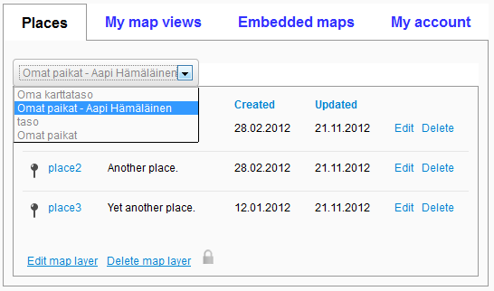
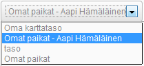

# TabPanel, TabContainer & TabDropdownContainer

## Description

A TabPanel is a wrapper for a title, a header and content (html) and can call a handler when the tab is selected or unselected.

A TabContainer renders TabPanels as selectable tabs whereas a TabDropdownContainer represents the TabPanel collection as a dropdown list. A callback for panel changes can be registered for both.

## Screenshot




## Usage

### Simple TabContainer

```javascript
var aPanel = Oskari.clazz.create('Oskari.userinterface.component.TabPanel');
var anotherPanel = Oskari.clazz.create('Oskari.userinterface.component.TabPanel');
var container = null;

aPanel.setTitle('A TabPanel');
aPanel.setContent(someHtml);
anotherPanel.setTitle('Another TabPanel');
anotherPanel.setContent(someMoreHtml);
if (useDropDown) {
  container = Oskari.clazz.create('Oskari.userinterface.component.TabDropdownContainer', 'A TabDropdownContainer');
} else {
  container = Oskari.clazz.create('Oskari.userinterface.component.TabContainer', 'A TabContainer');
}
container.addPanel(aPanel);
container.addPanel(anotherPanel);
container.insertTo(someElement);
```

## Dependencies

<table class="table">
  <tr>
    <th>Dependency</th><th>Linked from</th><th>Purpose</th>
  </tr>
  <tr>
    <td> [jQuery](http://api.jquery.com/) </td>
    <td> Version 1.7.1 assumed to be linked on the page</td>
    <td> Used to create the component UI from begin to end</td>
  </tr>
</table>
