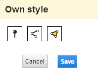

# VisualizationForm

## Description

Creates ui and functionality to define geometry visualizations for eg. my places bundle.

## Screenshot



## Usage

Class creation (parameters are discussed below):

```javascript
var options = {...};
var visualizationForm = Oskari.clazz.create(
    "Oskari.userinterface.component.VisualizationForm",
    options
);
```

After initializing the class, the form can be placed on the DOM:

```javascript
var form = visualizationForm.getForm();
someDomElement.append(form);
```

The values of the form can then be requested (returns an object which has keys for each of the form components given in initialization options, or all three by default):

```javascript
var values = visualizationForm.getValues();
console.log(values);
```

Outputs for instance:

```javascript
{
  area: {
    fillColor: "ffde00"
    fillStyle: -1
    lineColor: "000000"
    lineCorner: "mitre"
    lineStyle: ""
    lineWidth: 1
  },
  line: {
    cap: "butt"
    color: "3233ff"
    corner: "mitre"
    style: ""
    width: 1
  },
  point: {
    color: "000000"
    shape: 1
    size: 3
  }
}
```

`area.fillColor` and `area.lineColor` can have value `null` to mean "no fill" / "no stroke" respectively

The component also accepts values with similar structure as above:

```javascript
var values = {...};
visualizationForm.setValues(values);
```

## Configuration options

Takes one (optional) parameter, `options`. In case it is omitted, the component uses some sensible defaults.

`options` should have two keys, `forms`, whose value should be an array of strings, for instance:

```javascript
// includes all three by default. Can be configured to include any combination of the three.
['point', 'line', 'area']
```

The other `options` key should be `formValues` which defines default values to each form. Example:

```javascript
// These are the default values of the component:
formValues: {
    point: {
        shape: 1,
        color: "000000",
        size: 3
    },
    line: {
        style: 0,
        cap: 0,
        corner: 0,
        width: 1,
        color: "3233ff"
    },
    area: {
        line: {
            width: 1,
            corner: 0,
            style: 0,
            color: "000000"
        },
        fill: {
            style: -1,
            color: "ffde00"
        }
    }
}
```

## Dependencies

<table class="table">
  <tr>
    <th>Dependency</th><th>Linked from</th><th>Purpose</th>
  </tr>
  <tr>
    <td> [jQuery](http://api.jquery.com/) </td>
    <td> Version 1.7.1 assumed to be linked on the page</td>
    <td> Used to create the component UI from begin to end</td>
  </tr>
</table>
