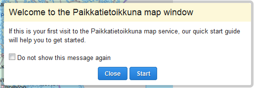

# guidedtour

## Description

Shows a series of dialogs on startup to instruct user on map functionalities. The content of the dialogs is supplied from the bundles that the guided tour describes. Any bundle can register itself to the guided tour.

Without configuration, the tour shows dialogs for all bundles that have registered themselves, in the order determined by a priority value given by the bundles.

With configuration, the tour can be specified to show only a subset of the registered bundles and/or change the order of the dialogs. It's also possible to override the text content of the dialogs by giving Oskari GetArticlesByTag-API tags in the configuration.

## Screenshot



## Bundle configuration

Configuration is optional. See description above for default behavior.

Which dialogs to show and their order is defined with an Array in the property "steps". The order is the same as the order of elements in the Array. Only dialogs for bundles that are referenced in the Array will be shown. Allowed fields for an array element (dialog configuration) are:

<table class="table">
  <tr>
    <th>bundleName</th><td>Required. The name of the bundle registered to the guide. From bundle getName() method. If a bundle registers more than one dialog, the different dialogs are referenced by adding a number after underscore, "MainMapModule_1", "MainMapModule_2", etc.</td>
  </tr>
  <tr>
    <th>content</th><td>Optional. Tags used to retrieve dialog content from GetArticlesByTag-API. Retrieved html replaces default dialog content.</td>
  </tr>
</table>

To replace the content of the first "Welcome" dialog, add element with bundleName "GuidedTour" and with content tags.


```javascript
{  
   steps:[
      {  
         "bundleName": "GuidedTour",
         "content": "tour_welcome"
      },
      {  
         "bundleName": "Search"
      },
      {  
         "bundleName": "PersonalData"
      },
      {  
         "bundleName": "MainMapModule_1"
      },
      {  
         "bundleName": "MainMapModule_2",
         "content": "tour_zoom"
      }
   ]
}
```


## Requests the bundle handles

<table class="table">
  <tr>
    <th>Request</th><th>How does the bundle react</th>
  </tr>
  <tr>
    <td>Guidedtour.AddToGuidedTourRequest</td><td>Adds the requesting bundle to the guided tour. The request parameter is a delegate object that has configuration and methods for generating the content of the dialog.</td>
  </tr>
</table>

### The delegate object field specification:

<table class="table">
  <tr>
    <th>bundleName</th><td>Required. The name of the bundle registered to the guide. Should come from bundle getName() method. If a bundle registers more than one dialog, the different dialogs should be referenced by adding a number after underscore, "MainMapModule_1", "MainMapModule_2", etc.</td>
  </tr>
  <tr>
    <th>getTitle</th><td>Required. Method for retrieving dialog title. Returns String.</td>
  </tr>
  <tr>
    <th>getContent</th><td>Required. Method for retrieving dialog content. Returns jQuery object.</td>
  </tr>
  <tr>
    <th>getLinks</th><td>Optional. Method for retrieving links shown below main content. Returns Array of jQuery objects.</td>
  </tr>
  <tr>
    <th>priority</th><td>Optional. Positive integer representing ordering priority. Larger numbers mean lower priority and come after smaller numbers. If priority is not given, dialog is added at priority of the largest already registered priority +1 (at the end of guided tour)</td>
  </tr>
  <tr>
    <th>getPositionRef</th><td>Optional. Method returning jQuery object represening element the dialog should align itself to. Used to call dialog.moveTo(...)</td>
  </tr>
  <tr>
    <th>positionAlign</th><td>Optional. Dialog alignment in reference to positionRef. One of 'left', 'right', 'top', 'bottom', 'center'. Used to call dialog.moveTo(...)</td>
  </tr>
  <tr>
    <th>show</th><td>Optional. Method that is called when step is shown in the tour. Typicaly used to activate Tiles etc.</td>
  </tr>
  <tr>
    <th>hide</th><td>Optional. Method that is called when step is no longer shown in the tour. Typicaly used to close Tiles etc.</td>
  </tr>
</table>

Example:

```javascript
var me = this;
function updateExtension(payload) {
    me.sandbox.postRequestByName('userinterface.UpdateExtensionRequest', payload);
}
var requestBuilder = Oskari.requestBuilder('Guidedtour.AddToGuidedTourRequest');
if (requestBuilder) {
    var delegate = {
        priority: 10,
        show: function () {
            updateExtension([null, 'attach', 'Search']);
        },
        hide: function () {
            updateExtension([null, 'close', 'Search']);
        },
        getTitle: function () {
            return me.localization.guidedTour.title;
        },
        getContent: function () {
            var content = jQuery('<div></div>');
            content.append(me.localization.guidedTour.message);
            return content;
        },
        getLinks: function () {
            var loc = me.localization.guidedTour;
            var linkTemplate = jQuery('<a href="#"></a>');
            var openLink = linkTemplate.clone();
            openLink.append(loc.openLink);
            openLink.bind('click',
                function () {
                    updateExtension([null, 'attach', 'Search']);
                    openLink.hide();
                    closeLink.show();
                });
            var closeLink = linkTemplate.clone();
            closeLink.append(loc.closeLink);
            closeLink.bind('click',
                function () {
                    updateExtension([null, 'close', 'Search']);
                    openLink.show();
                    closeLink.hide();
                });
            closeLink.show();
            openLink.hide();
            return [openLink, closeLink];
        },
        getPositionRef: function () {
            return jQuery('.panbuttonDiv');
        },
        positionAlign: 'left'
    };
    me.sandbox.request(me, requestBuilder(delegate));
}
```


## Dependencies

<table class="table">
  <tr>
    <th>Dependency</th><th>Linked from</th><th>Purpose</th>
  </tr>
  <tr>
    <td> [jQuery](http://api.jquery.com/) </td>
    <td> Linked in portal theme </td>
    <td> Used to create the component UI from begin to end</td>
  </tr>
</table>