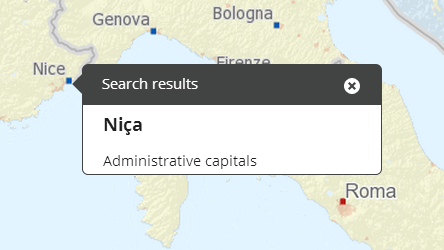

# infobox

## Description

Provides functionality for other bundles to show an infobox on the map. For example information about a search result. Defines a plugin for mapmodule that handles the infobox as an Openlayers popup with customized UI. Also extends jQuery by an outerHtml method. Templates are created with jQuery but Openlayers popup needs the actual HTML, this is where we need outerHtml.

## Screenshot



## Bundle configuration

No configuration is required, but it can be used to adapt infobox size according to its content. If not set, infobox size will be 300px x 400px.

```javascript
{
  "adaptable" : true
}
```

## Bundle state

```javascript
state : {
  popups : [
    {
      id : <popup id>,
      title :  <popup title>,
      data :  <data as given in Oskari.mapframework.bundle.infobox.request.ShowInfoBoxRequest.getContent()>,
      lonlat : <OpenLayers.LonLat as location for the popup>
    }
  ]
}
```

## Dependencies

<table class="table">
  <tr>
    <th>Dependency</th><th>Linked from</th><th>Purpose</th>
  </tr>
  <tr>
    <td> [jQuery](http://api.jquery.com/) </td>
    <td> Version 1.7.1 assumed to be linked on the page</td>
    <td> Used to create the component UI from begin to end </td>
  </tr>
  <tr>
    <td> [OpenLayers](http://openlayers.org/) </td>
    <td> Expects OpenLayers already linked </td>
    <td> To control map and show an Openlayers popup on it</td>
  </tr>
  <tr>
    <td> [Oskari mapmodule](/documentation/bundles/framework/mapmodule)</td>
    <td> Expects to be present in application setup </td>
    <td> To register plugin to map/gain control to Openlayers map</td>
  </tr>
</table>
