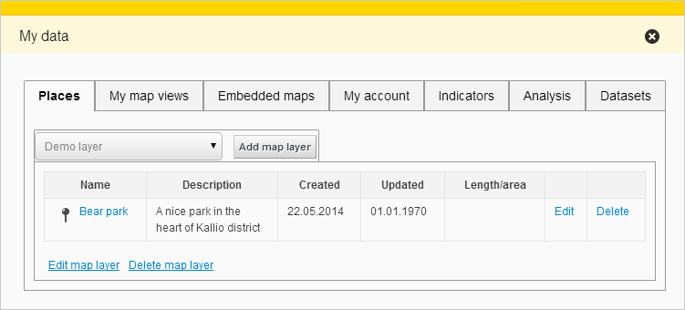

# personaldata

Provides generic functionality to show user-specific information.

## Description

The bundle lists user's account information and saved data in the application.
Currently lists account info, saved map views and embedded maps.
Other bundles can request to list data related to their domain (eg. my places, user indicators) here.



*Here shown with tabs added by `myplaces`, `statistics/statsgrid`, `analysis/analyse` and `myplacesimport` bundles*

## TODO

* Move the tabs for saved map views and embedded maps to more appropriate locations and use `PersonalData.AddTabRequest` to add them

## Bundle configuration

Configuration is optional:

```javascript
"conf": {
  "changeInfoUrl": {
    "en": "https://www.paikkatietoikkuna.fi/web/en/profile",
    "fi": "https://www.paikkatietoikkuna.fi/web/fi/profiili",
    "sv": "https://www.paikkatietoikkuna.fi/web/sv/profil"
  }
}
```

changeInfoUrl should point to an url where the user can change his/her profile information.
The bundle will show a link to the configured page if the URL is configured.

## Requests the bundle sends out

<table class="table">
<tr>
  <th> Request </th>
  <th> Where/why it's used</th>
</tr>
<tr>
  <td> `Publisher.PublishMapEditorRequest` </td>
  <td> When an embedded maps 'Edit' link is clicked to activate the publisher bundle </td>
</tr>
<tr>
  <td> `userinterface.UpdateExtensionRequest` </td>
  <td> When an embedded maps 'Edit' link is clicked to close the personaldata flyout </td>
</tr>

<tr>
  <td> `Toolbar.AddToolButtonRequest` </td>
  <td> If 'StateHandler.SaveStateRequest' can be used/is part of the application.
  Adds a toolbar button for saving views when the bundle is started.
  Button is disabled for guest users.</td>
</tr>
<tr>
  <td> `StateHandler.SaveStateRequest` </td>
  <td> When the save view button is clicked </td>
</tr>
<tr>
  <td> `StateHandler.SetStateRequest` </td>
  <td> When the name of a saved view or 'Show' link of an embedded map is clicked </td>
</tr>

</table>

## Events the bundle listens to

<table class="table">
  <tr>
    <th> Event </th><th> How does the bundle react</th>
  </tr>
  <tr>
    <td> `Publisher.MapPublishedEvent` </td><td> Refreshes the embedded maps listing </td>
  </tr>
</table>

## Dependencies

<table class="table">
  <tr>
    <th>Dependency</th>
    <th>Linked from</th>
    <th>Purpose</th>
  </tr>
  <tr>
    <td> [Oskari divmanazer](/documentation/bundles/framework/divmanazer)</td>
    <td> Expects to be present in application setup </td>
    <td> Bundle has a Flyout and Tile so a divmanazer is needed </td>
  </tr>
  <tr>
    <td> [Oskari ui-components](/documentation/bundles/framework/ui-components)</td>
    <td> Expects to be present in application setup </td>
    <td> For showing popup and other UI components </td>
  </tr>
  <tr>
    <td> [jQuery](http://api.jquery.com/) </td>
    <td> Version 1.7.1 assumed to be linked on the page</td>
    <td> Used to create the component UI from begin to end</td>
  </tr>
</table>
